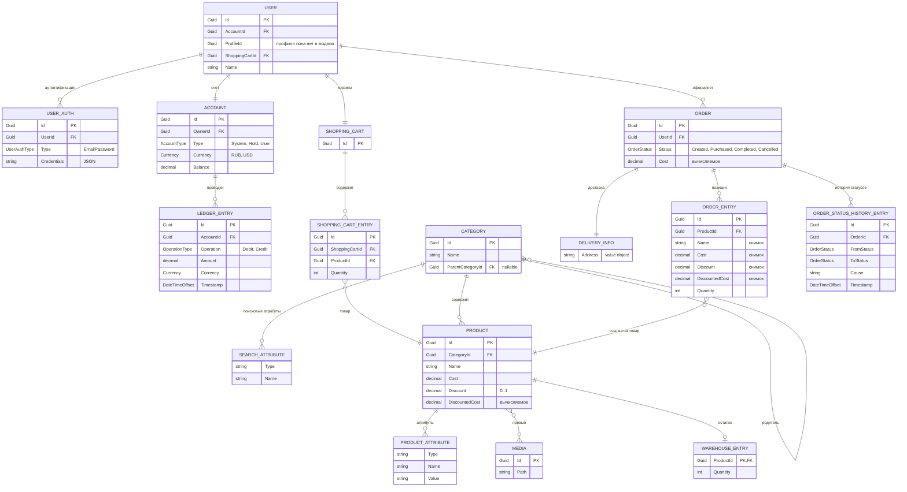

```mermaid
erDiagram
    USER {
        Guid Id PK
        Guid AccountId FK
        Guid ProfileId "профиля пока нет в модели"
        Guid ShoppingCartId FK
        string Name
    }

    USER_AUTH {
        Guid Id PK
        Guid UserId FK
        UserAuthType Type "EmailPassword"
        string Credentials "JSON"
    }

    ACCOUNT {
        Guid Id PK
        Guid OwnerId FK
        AccountType Type "System, Hold, User"
        Currency Currency "RUB, USD"
        decimal Balance
    }

    LEDGER_ENTRY {
        Guid Id PK
        Guid AccountId FK
        OperationType Operation "Debit, Credit"
        decimal Amount
        Currency Currency
        DateTimeOffset Timestamp
    }

    SHOPPING_CART {
        Guid Id PK
    }

    SHOPPING_CART_ENTRY {
        Guid Id PK
        Guid ShoppingCartId FK
        Guid ProductId FK
        int Quantity
    }

    CATEGORY {
        Guid Id PK
        string Name
        Guid ParentCategoryId FK "nullable"
    }

    SEARCH_ATTRIBUTE {
        string Type
        string Name
    }

    PRODUCT {
        Guid Id PK
        Guid CategoryId FK
        string Name
        decimal Cost
        decimal Discount "0..1"
        decimal DiscountedCost "вычисляемое"
    }

    PRODUCT_ATTRIBUTE {
        string Type
        string Name
        string Value
    }

    MEDIA {
        Guid Id PK
        string Path
    }

    WAREHOUSE_ENTRY {
        Guid ProductId PK, FK
        int Quantity
    }

    ORDER {
        Guid Id PK
        Guid UserId FK
        OrderStatus Status "Created, Purchased, Completed, Cancelled"
        decimal Cost "вычисляемое"
    }

    DELIVERY_INFO {
        string Address "value object"
    }

    ORDER_ENTRY {
        Guid Id PK
        Guid ProductId FK
        string Name "снимок"
        decimal Cost "снимок"
        decimal Discount "снимок"
        decimal DiscountedCost "снимок"
        int Quantity
    }

    ORDER_STATUS_HISTORY_ENTRY {
        Guid Id PK
        Guid OrderId FK
        OrderStatus FromStatus
        OrderStatus ToStatus
        string Cause
        DateTimeOffset Timestamp
    }

    USER ||--o{ USER_AUTH : "аутентификация"
    USER ||--|| ACCOUNT : "счет"
    USER ||--|| SHOPPING_CART : "корзина"
    USER ||--o{ ORDER : "оформляет"

    ACCOUNT ||--o{ LEDGER_ENTRY : "проводки"

    SHOPPING_CART ||--o{ SHOPPING_CART_ENTRY : "содержит"
    SHOPPING_CART_ENTRY }o--|| PRODUCT : "товар"

    CATEGORY ||--o{ CATEGORY : "родитель"
    CATEGORY ||--o{ SEARCH_ATTRIBUTE : "поисковые атрибуты"
    CATEGORY ||--o{ PRODUCT : "содержит"

    PRODUCT ||--o{ PRODUCT_ATTRIBUTE : "атрибуты"
    PRODUCT }o--o{ MEDIA : "превью"
    PRODUCT ||--o| WAREHOUSE_ENTRY : "остаток"

    ORDER ||--|| DELIVERY_INFO : "доставка"
    ORDER ||--o{ ORDER_ENTRY : "позиции"
    ORDER ||--o{ ORDER_STATUS_HISTORY_ENTRY : "история статусов"
    ORDER_ENTRY }o--|| PRODUCT : "ссылка на товар"
```